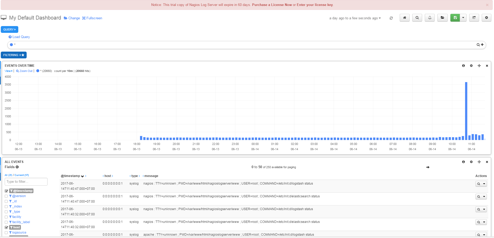

# Requirements
- CentOS 7
- Single Core Processor
- 2 GB RAM

# Installtion
## Linux file
### Trên server
- Gõ các lệnh sau:
    
        cd /tmp
        wget https://assets.nagios.com/downloads/nagios-log-server/nagioslogserver-latest.tar.gz
        tar xzf nagioslogserver-latest.tar.gz
        cd nagioslogserver
        ./fullinstall

- Sau đó truy cập vào địa chỉ web sau: `http://your_ip_server/nagioslogserver` đăng nhập để hoàn thành việc cài đặt.

- Giao diện sau cài đặt xong

- Thêm source log từ linux, chọn `+ Log source` -> `linux source`

Ở đây sẽ có hướng dẫn cho từng server (địa chỉ của từng server) chỉ việc copy vào client và chạy. Nếu muốn gửi file hoặc thư mục bắt kỳ thì thêm đường dẫn của nó vào sau lệnh chạy file script. Kéo xuống dưới, bấm vào `linux file` để xem hướng dẫn.

### Trên client
- Copy lệnh từ server:

    curl -s -O http://192.168.169.194/nagioslogserver/scripts/setup-linux.sh
    sudo bash setup-linux.sh -s 192.168.169.194 -p 5544 -f "/path/to/file /path/to/another/file/*.log" -t FILE_TAG

Ví dụ: 

    sudo bash setup-linux.sh -s 192.168.169.194 -p 5544 -f "/var/log/*" -t 191Ubuntu_log
  
- Sau đó vào Dashboard sẽ được như sau:
 
 

## Window file
Xem hướng dẫn trên web interface của nagios như trên.

Sau khi cài nxlog sửa file nxlog.conf ở `C:\Program Files\nxlog\conf\nxlog.conf` hoặc `C:\Program Files (x86)\nxlog\conf\nxlog.conf` để send event log. 

Ví dụ: [nxlog.conf](nxlog.conf)

Sau đó chạy lệnh `net start nxlog` để bắt đầu

Vào Dashboard

